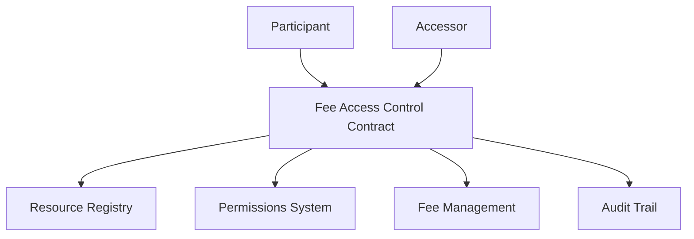

# Fee Parse: Flexible Fee-Based Access Control

A blockchain-based access control mechanism with granular, fee-driven resource sharing and permission management.

## Overview

Fee Parse provides a robust, flexible system for managing access to digital resources through a programmable, blockchain-native permission and fee structure. By implementing a generalized access control mechanism, the platform enables precise, auditable, and economically incentivized resource sharing across various domains.

### Key Features

- Flexible, fee-based access permissions
- Secure resource registration system
- Verified accessor authentication
- Comprehensive access audit trail
- Multi-resource type support
- Programmable access controls

## Architecture

The Fee Parse system is built around a core smart contract that manages:
- Participant registration and authentication
- Resource registration and management
- Access control and permissions
- Accessor verification
- Access history and fee tracking



## Contract Documentation

### Fee Access Control Contract

The main contract (`fee-access-control.clar`) handles core functionality for access management.

#### Resource Types Supported
- Documents
- Media
- Data
- Services

#### Key Components

1. **Participant Management**
   - Participant registration
   - Resource registration
   
2. **Access Control**
   - Permission granting/revoking
   - Accessor verification
   - Fee-based access management

3. **Audit System**
   - Comprehensive access logging
   - Fee tracking and historical access records

## Getting Started

### Prerequisites
- Clarinet
- Stacks wallet
- Access to the Stacks blockchain

### Basic Usage

1. **Register as a Participant**
```clarity
(contract-call? .fee-access-control register-participant)
```

2. **Register a Resource**
```clarity
(contract-call? .fee-access-control register-resource "resource-123" "document")
```

3. **Grant Access with Fee**
```clarity
(contract-call? .fee-access-control grant-access 
    'SP2JXKH6B14RMT7PP51439ZPWZQYNB3HB5J2289WB 
    "document" 
    (some u100000)
    u500)  ; Fee amount
```

## Function Reference

### Public Functions

#### Participant Management
```clarity
(define-public (register-participant))
(define-public (register-resource (resource-id (string-ascii 64)) (resource-type (string-ascii 64))))
```

#### Access Control
```clarity
(define-public (grant-access 
    (accessor principal) 
    (resource-type (string-ascii 64)) 
    (expiry (optional uint))
    (fee-amount uint)
))
(define-public (revoke-access (accessor principal) (resource-type (string-ascii 64))))
```

### Read-Only Functions
```clarity
(define-read-only (check-participant-registration (participant principal)))
(define-read-only (check-accessor-verification (accessor principal)))
(define-read-only (check-access-permission 
    (participant principal) 
    (accessor principal) 
    (resource-type (string-ascii 64))
))
(define-read-only (get-access-details (access-id uint)))
```

## Development

### Testing
1. Clone the repository
2. Install Clarinet
3. Run tests:
```bash
clarinet test
```

### Local Development
1. Start Clarinet console:
```bash
clarinet console
```
2. Deploy contracts:
```clarity
(contract-call? .fee-access-control register-participant)
```

## Security Considerations

### Data Privacy
- Flexible, configurable access controls
- Granular permission management
- Fee-based access tracking
- Comprehensive audit logging

### Access Control
- Implement robust accessor verification
- Use time-limited access grants
- Configure precise fee structures
- Monitor and audit access events

### Best Practices
- Carefully design fee structures
- Implement multi-stage verification for accessors
- Use time-bound and revocable access grants
- Continuously monitor and update access policies